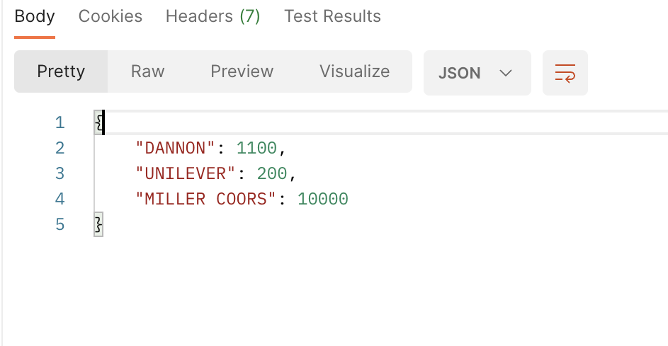
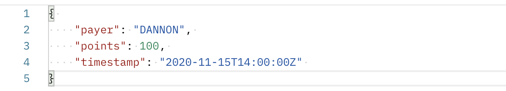
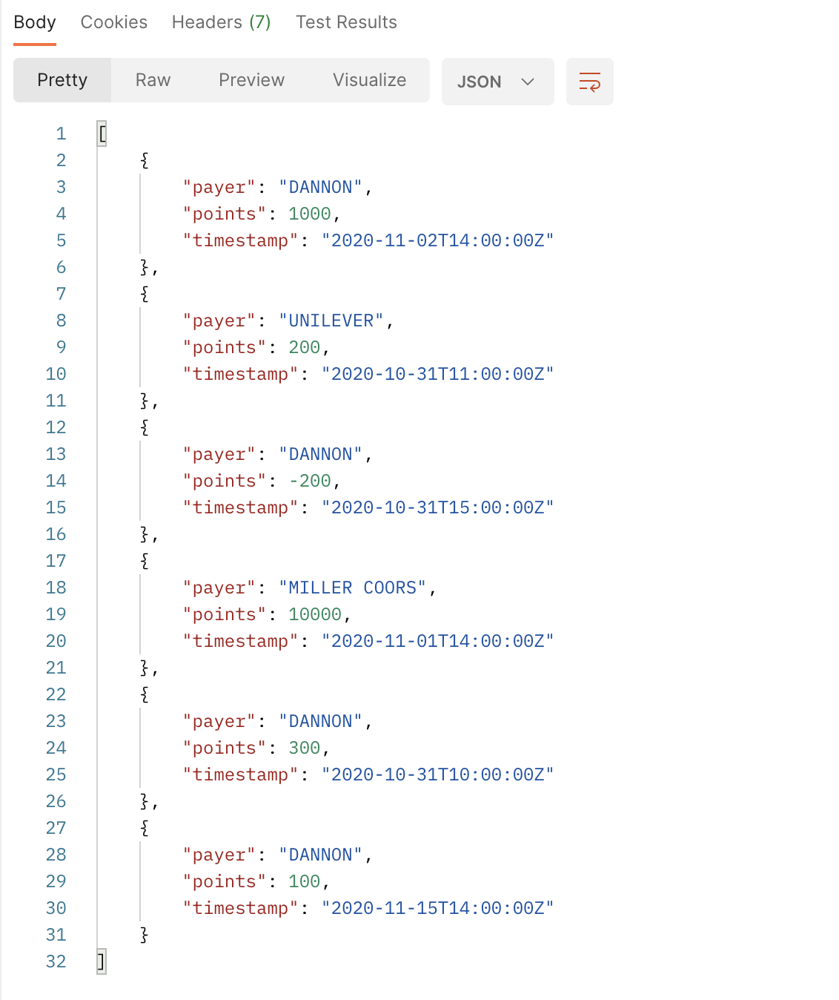
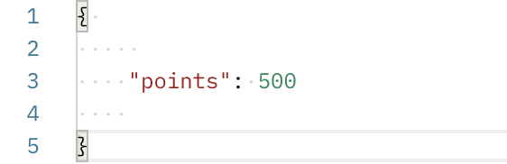
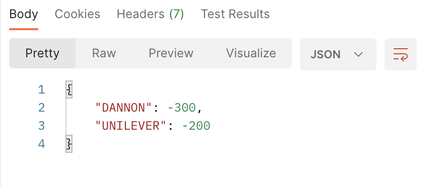

# Fetch Rewards API
This is a simple API to satisfy the Backend-Apprenticship coding challenge. The challenge had three requirments: 

1. Add transactions for a specific payer and date
2. Spend points using the rules outlined in the assignment ( a payer's balance can not go negative and the points with the oldest timestamp should be spent first )
3. Return all payer point balances

## Instructions
1. Fork and clone repo to local machine
2. Run npm install
3. Run npm start

## Points API

| Type | Route | Description |
|------ | ------ | ------------ |
| GET | /points | Fetches all payers with their respective point balances. |
| POST | /points | Creates a new transaction to append to the list. All transactions require a 'payer', 'points' and a 'timestamp'. |
| POST | /points/spend | Deducts points starting at the transaction with the oldest timestamp. |

## Examples 
### Fetch Points
`GET`: `http://localhost:5000/points`

Response:

### Add Transactions
`POST`: `http://localhost:5000/points`

Request:

Response:

### Spend Points
`POST`: `http://localhost:5000/points/spend`

Request:

Response:

## Tools
 Express.js | Body-Parsar | DotEnv

